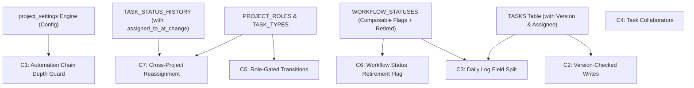

# Ziel Generalised Project Engine v1.1: Changes & Task Division Plan

## 1. Executive Summary of v1.1 Changes

The **Ziel Generalised Project Engine v1.1** introduces critical safeguards, concurrency controls, role-based transition security, and workflow flexibility. 

Here are the 7 major structural changes introduced in version 1.1:

| # | Feature / Change Name | Specification Section | Description |
|---|---|---|---|
| **C1** | **Automation Chain-Depth Guard** | Section 10.1 | Prevents infinite loops when automation rules trigger further automation. Tracks `chain_depth` (incremented on each cascaded event) and caps it using `automation.max_chain_depth` in `project_settings` (default: 5). Emits `Task Automation Loop Detected` when breached. |
| **C2** | **Version-Checked Task Writes** | Sections 7, 8, 13 | Implements optimistic concurrency control on `TASKS`. An integer `version` field increments on every write to `workflow_status_id` or `assignee_id`. All updates (Logs, Automations, Admin Overrides) must send the expected version; stale writes are rejected. |
| **C3** | **Daily Log Field Split** | Section 8 | Splits work logging into `hours_status_id` (always required; attributes hours to active status) and `declared_transition_to` (nullable; requests a status transition). Transition validation runs only when `declared_transition_to` is present and different from current status. |
| **C4** | **Task Collaborators** | Sections 7, 9, 12 | Adds `TASK_COLLABORATORS` table (`task_id`, `user_id`, `added_at`) to support multiple secondary contributors without diluting single ownership (`assignee_id`) required for log-gating and reassignment. |
| **C5** | **Role-Gated Workflow Transitions** | Section 6 | Adds `allowed_role_ids` (nullable array) to `WORKFLOW_TRANSITIONS`. Allows restricting specific status moves (e.g., *Closed Won*, *Escalated*) to users holding specific project roles. |
| **C6** | **Workflow Status Retirement Flag** | Section 6 | Adds a `retired` boolean flag to `WORKFLOW_STATUSES`. Prevents hard deletion of statuses referenced in history or transitions; retired statuses remain valid for existing tasks but cannot be selected for new transitions. |
| **C7** | **Cross-Project Workload Reassignment** | Section 9 | Updates the workload fallback reassignment algorithm. When reassigning a task by role, active task counts are calculated across **all projects in the organization** rather than a single project. |

---

## 2. Dependency Analysis Matrix

To safely divide these features between two developers, we must understand which components require pre-requisite foundation layers (schema or helper tables) and which components can be built independently.



### Key Dependency Rules:

1. **`C5: Role-Gated Transitions`** depends on **`PROJECT_ROLES`** and **`WORKFLOW_TRANSITIONS`**. Roles must exist before transition rules can reference `allowed_role_ids`.
2. **`C3: Daily Log Field Split`** depends on **`WORKFLOW_STATUSES`** and the core **`TASKS`** table. Log validation requires checking `declared_transition_to` against valid transition rules.
3. **`C2: Version-Checked Task Writes`** depends on the `version` column in the **`TASKS`** table. All status/assignment write handlers must be wrapped with version-verification logic.
4. **`C1: Automation Chain-Depth Guard`** depends on **`project_settings`** (`automation.max_chain_depth`) and the domain event bus infrastructure.
5. **`C7: Cross-Project Workload Reassignment`** depends on **`TASK_STATUS_HISTORY.assigned_to_at_change`** and organizational member active task aggregation.
6. **`C4: Task Collaborators`** is **100% Independent**. It touches a separate lookup table (`TASK_COLLABORATORS`) and does not block or get blocked by workflow engine rules.
7. **`C6: Status Retirement Flag`** is **100% Independent** schema-wise (adds `retired` boolean to `WORKFLOW_STATUSES`).

---

## 3. Dependency & Parallelization Table

This table classifies each feature as **Dependent** or **Independent**, lists its prerequisites, and shows if it can be developed in parallel.

| Feature ID & Name | Type | Prerequisite / Blocking Feature | Can Build in Parallel? | Parallel With |
|---|---|---|---|---|
| **C1: Automation Chain Guard** | **Dependent** | `project_settings` key-value store & Event Bus | Yes (once `project_settings` is ready) | C2, C3, C4 |
| **C2: Version-Checked Task Writes** | **Dependent** | `TASKS.version` schema column | Yes | C4, C5, C6 |
| **C3: Daily Log Field Split** | **Dependent** | `WORKFLOW_STATUSES` & `DAILY_LOGS` table update | Yes | C4, C5, C7 |
| **C4: Task Collaborators** | **Independent** | None (Requires basic `TASKS` table) | **Yes (Immediately)** | All features |
| **C5: Role-Gated Transitions** | **Dependent** | `PROJECT_ROLES` & `WORKFLOW_TRANSITIONS` | Yes (once `PROJECT_ROLES` exists) | C2, C3, C4 |
| **C6: Status Retirement Flag** | **Independent** | `WORKFLOW_STATUSES` table | **Yes (Immediately)** | All features |
| **C7: Cross-Project Workload Reassignment** | **Dependent** | `TASK_STATUS_HISTORY.assigned_to_at_change` & `PROJECT_MEMBERS` | Yes | C2, C3, C4 |

---

## 4. Proposed Task Division for 2 Developers

To achieve maximum efficiency without code collisions or blocking dependencies, the work is divided into two balanced streams: **Developer A (Execution Engine, Concurrency & Logs)** and **Developer B (Workflows, Roles, Automation & Reassignment)**.

### 👤 Developer A: Execution Engine, Concurrency & Log Advancement

> **Focus**: Core Task mutation safety, Daily Log validation, and Collaborators.

* **Module A1: Schema & Concurrency Baseline**
  * Add `version` integer column to `TASKS` table.
  * Implement optimistic concurrency check utility function (reject write if submitted version != stored version).
* **Module A2: Daily Log Field Split (`C3`)**
  * Update `DAILY_LOGS` table: add `hours_status_id` (NOT NULL) and `declared_transition_to` (NULLABLE).
  * Build transition validator that checks `declared_transition_to` against `WORKFLOW_TRANSITIONS`.
  * Ensure status writes pass `version` and update `TASK_STATUS_HISTORY`.
* **Module A3: Task Collaborators (`C4`)** *(Independent)*
  * Create `TASK_COLLABORATORS` table (`task_id`, `user_id`, `added_at`).
  * Implement API endpoints/services to add/remove collaborators.
  * Verify that collaborator logic does not interfere with primary `assignee_id` log-gating.

---

### 👤 Developer B: Workflows, Roles, Automation & Reassignment

> **Focus**: Configuration engine, Role security, Status flags, Reassignment, and Event safety.

* **Module B1: Configuration & Roles Foundation**
  * Create/Update `project_settings` key-value engine.
  * Create `PROJECT_ROLES` and `TASK_TYPES` tables and permission checker.
* **Module B2: Workflow Enhancements (`C5` & `C6`)**
  * Add `retired` boolean flag to `WORKFLOW_STATUSES` and update query filters to hide retired statuses from dropdowns.
  * Add `allowed_role_ids` to `WORKFLOW_TRANSITIONS` and integrate role validation into transition checks.
* **Module B3: Reassignment Engine (`C7`)**
  * Implement `TASK_STATUS_HISTORY.assigned_to_at_change` logging.
  * Build reassignment algorithm: look up previous holder by status -> fallback to member with lowest active task count across **all projects**.
* **Module B4: Automation Chain-Depth Protection (`C1`)**
  * Add `chain_depth` field to domain events.
  * Implement depth check using `automation.max_chain_depth` from `project_settings` (default: 5).
  * Emit `Task Automation Loop Detected` event when depth limit is reached.

---

## 5. Execution Timeline & Sync Points

```
Phase 1 (Day 1-2): Foundation & Independent Features
├── Developer A: TASKS.version schema (A1) + TASK_COLLABORATORS (A3)
└── Developer B: project_settings (B1) + WORKFLOW_STATUSES retired flag (B2)

Phase 2 (Day 3-5): Dependent Engine Logic
├── Developer A: DAILY_LOGS split & version-checked transition validator (A2)
└── Developer B: Role-gated transitions (B2) + Cross-Project Reassignment (B3)

Phase 3 (Day 6-7): Automation Safeguards & Integration
├── Developer A: Admin override auditing & API version enforcement
└── Developer B: Automation chain-depth guard (B4)

Phase 4 (Day 8): End-to-End Integration & Joint Verification
└── Both Devs: Joint testing of Concurrent Log Submissions, Reassignments, and Automation loops.
```

---

## 6. Database Migration Safety & Collision Prevention Audit

### DB Table Isolation Matrix

To guarantee that database migrations do not conflict or block each other, here is the exact audit of database tables modified by each developer:

| Database Table | Developer A Writes/Alters | Developer B Writes/Alters | Collision Risk | Mitigation / Rule |
|---|---|---|---|---|
| **`TASKS`** | Adds `version` INT column | Reads `assignee_id` | **ZERO Collision** | Dev A owns table migration for `version`. |
| **`DAILY_LOGS`** | Adds `hours_status_id` & `declared_transition_to` | No changes | **ZERO Collision** | Dev A owns `DAILY_LOGS` migration completely. |
| **`TASK_COLLABORATORS`** | Creates new table (`task_id`, `user_id`, `added_at`) | No changes | **ZERO Collision** | Dev A owns this new table creation. |
| **`PROJECT_SETTINGS`** | Reads settings (e.g. `log.status_change.assignee_only`) | Creates new table & writes settings | **ZERO Collision** | Dev B creates table; Dev A consumes setting key. |
| **`PROJECT_ROLES`** | No changes | Creates new table | **ZERO Collision** | Dev B owns table creation. |
| **`WORKFLOW_STATUSES`** | Reads flags (`is_completed`, etc.) | Adds `retired` BOOLEAN flag | **ZERO Collision** | Dev B owns schema update; Dev A reads `retired` status. |
| **`WORKFLOW_TRANSITIONS`**| Reads transitions for log validation | Adds `allowed_role_ids` UUID[] column | **ZERO Collision** | Dev B owns column addition. |
| **`TASK_STATUS_HISTORY`** | Writes audit log on Daily Log move | Adds `assigned_to_at_change` column | **ZERO Collision** | Dev B owns schema addition; Dev A populates row. |

### 🛡️ Recommended Database Migration Strategy:

1. **Use Standard Sequential Migration Files**:
   * Migration 1: `20260812000001_add_tasks_version.sql`
   * Migration 2: `20260812000002_split_daily_logs_fields.sql`
   * Migration 3: `20260812000003_create_project_roles_and_settings.sql`
   * Migration 4: `20260812000004_add_workflow_retired_and_allowed_roles.sql`
2. **Run Schema Migrations Upfront (Day 1 Baseline)**:
   * Execute all `ALTER TABLE` and `CREATE TABLE` scripts on Day 1 before building service code. Once tables are updated, both developers can write application code 100% independently in parallel.

